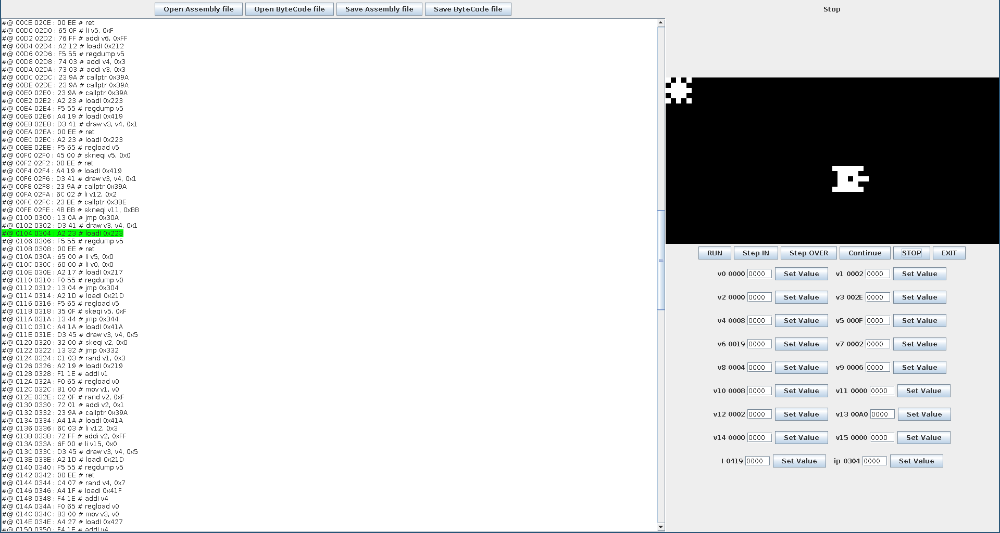

# Yet another CHIP-8 emulator
This is a simple [CHIP 8](https://en.wikipedia.org/wiki/CHIP-8) emulator, which I coded as a university project. It's features CHIP-8's assembler, disassembler and virtual machine capable of running code with a simple debugger to step over the instructions (currently due to my laziness breakpoints aren't implemented). This project uses MVC scheme and is most likely quite overengineered.

## Building
You can open this project in Intellij IDEA or use gradle (just run `gradle build`).

